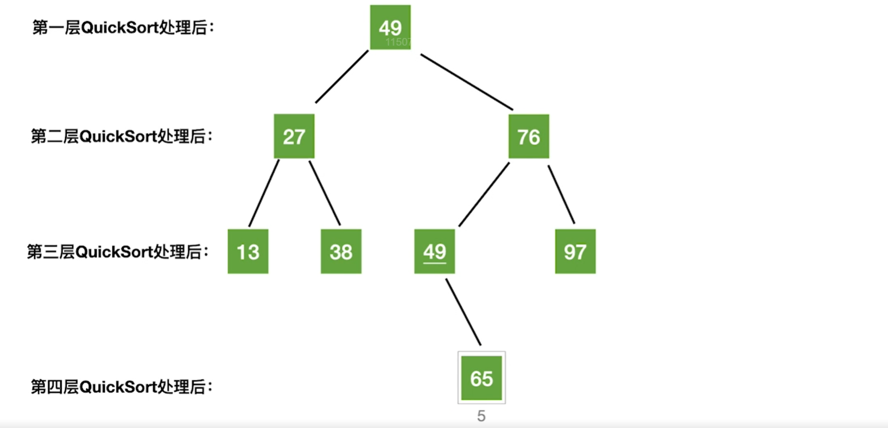

# 快速排序思想

每次使得一个中间元素（枢纽元素）确定最终位置，如果每次枢纽元素的最终位置在最前面/最后面，则快速排序算法性能退化成没有优化的冒泡排序算法

# 代码实现

```c
// 划分操作
// 划分操作主要是从两边向中间遍历元素，其时间复杂度不会超过O(n)
int Partition(StaticSequenceList &SSL, int low_index, int high_index)
{
    ElemType pivot_value = SSL.data[low_index];
    // 当low_index和high_index在一起的时候，所有的元素都被扫描了一遍
    // 这里如果是low_index<=high_index，则while()会一直执行下去，因为循环体内部不会更新low_index跟high_index
    while (low_index < high_index)
    {
        // 找右边比枢纽值小的，放到左边
        // 这里注意是>=，否则遇到相同的元素只会相互赋值，并不会更新low_index和high_index
        while (low_index < high_index && SSL.data[high_index] >= pivot_value)
        {
            high_index--;
        }
        SSL.data[low_index] = SSL.data[high_index];
        // 找左边比枢纽值大的，放到右边
        while (low_index < high_index && SSL.data[low_index] <= pivot_value)
        {
            low_index++;
        }
        SSL.data[high_index] = SSL.data[low_index];
    }
    SSL.data[low_index] = pivot_value;
    return low_index;
}

// 快速排序
bool QuickSort(StaticSequenceList &SSL, int low_index, int high_index)
{
    if (low_index < high_index) // 只有一个元素的时候就没必要进行划分了，因为已经有序了
    {
        int pivot_index = Partition(SSL, low_index, high_index);
        QuickSort(SSL, low_index, pivot_index - 1);
        QuickSort(SSL, pivot_index + 1, high_index);
        return true;
    }
    return false;
}

```

# 性能分析

## 时间复杂度

`Partition()`函数的主要功能是对区间内的元素全部遍历（扫描）一遍，其时间复杂度不会超过$O(n)$

每一层的 `QuickSort()`函数会将区间数组按照当前的基准元素划分为左右两组

第二层的 `QuickSort()`函数会将区间数组会将左右两组元素再划分为左右两组

...



**而每一层的 `QuickSort()`函数只需要调用 `Partition()`处理还没有排序的元素，时间复杂度不超过$O(n)$**

所以总的时间复杂度为$O(n \times 递归层数)$

### 最好情况下

递归次数最少：每一次层递归使用枢纽元素将顺序表划分为均匀的两个数组，这样递归层数会最少，其递归层数为$O(\log_2 n)$，所以时间复杂度为$O(n\log_2n)$

### 最坏情况下

递归次数最多：顺序表有序，每一次层递归使用枢纽元素将顺序表划分为非常不均匀的两个数组，这样递归层数会最多，其递归层数为$O(n)$，所以时间复杂度为$O(n^2)$

### 平均情况下

在实际应用中，快速排序的时间复杂度是接近于这种最好情况下的时间复杂度，所以在实际应用中，快速排序是在所有内部排序算法中，性能最优秀的排序算法

## 空间复杂度

快速排序算法是用递归思想实现的算法，所以快速排序算法的空间花费主要来自于递归的次数，而每一层递归（函数栈）中我们都会开辟一小片空间来保存一些相关的局部变量和返回地址呀

### 最好情况下

递归次数最少：每一次层递归使用枢纽元素将顺序表划分为均匀的两个数组，这样递归层数会最少，其递归层数为$O(\log_2 n)$，所以空间复杂度为$O(\log_2n)$

### 最坏情况下

递归次数最多：顺序表有序，每一次层递归使用枢纽元素将顺序表划分为非常不均匀的两个数组，这样递归层数会最多，其递归层数为$O(n)$，所以空间复杂度为$O(n)$

## 稳定性

举一个栗子：顺序表的元素序列为：2 2 1

经过快速排序算法之后，可以发现第一个2和第二个2的相对位置发生了改变，所以快速排序算法是不稳定的。
