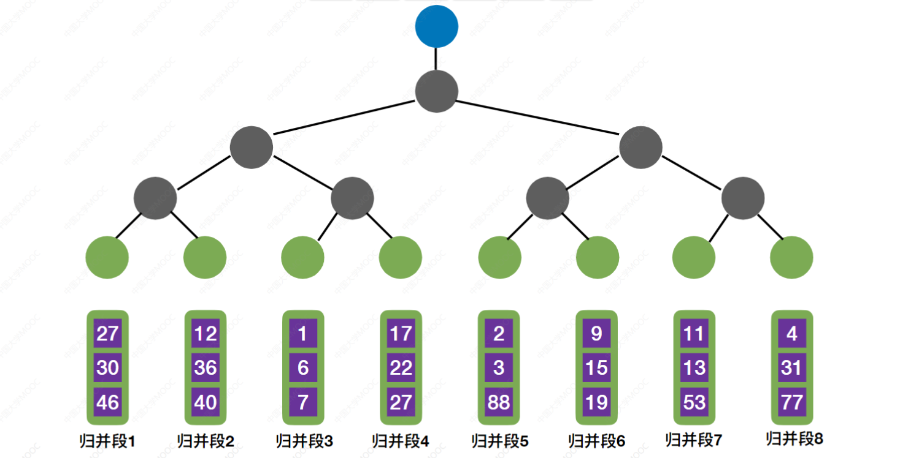
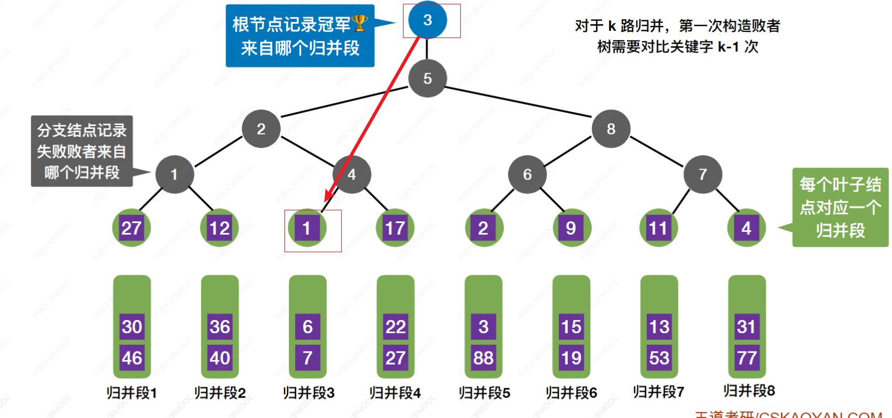
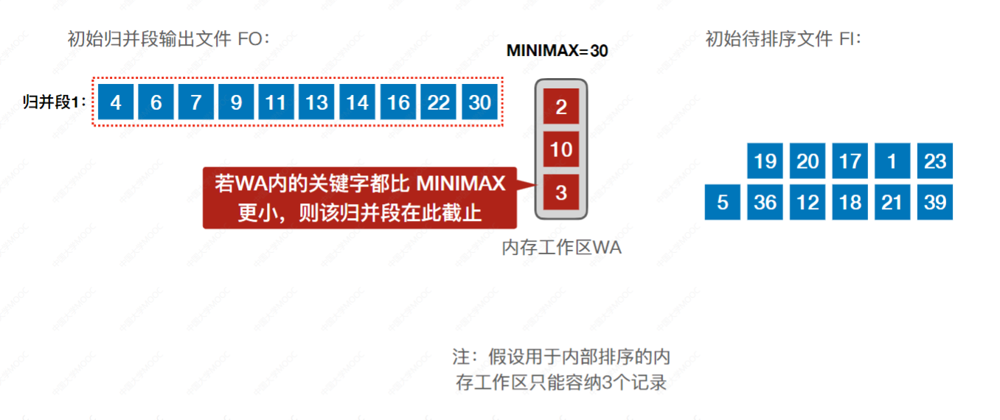
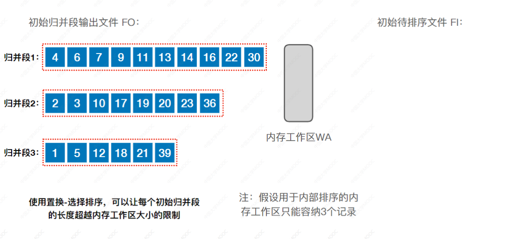

# 前言

前面介绍过的排序方法都是在内存中进行的(称为内部排序)。而在许多应用中，经常需要对大文件进行排序，因为文件中的记录很多，无法将整个文件复制进内存中进行排序。因此，需要将待排序的记录存储在外存上，排序时再把数据一部分一部分地调入内存进行排序，在排序过程中需要多次进行内存和外存之间的交换。这种排序方法就称为外部排序。

# 时间开销

外部排序时间开销 = 读写外存的时间+内部排序时间+内部归并时间

注意：归并排序每一次将两个有序的子序列进行归并，所以在归并排序开始之前我们首先要构造一些已经有序的子序列。

所以我们将磁盘块读入内存之后，采用内部排序就可以将其构造为有序的磁盘块，然后将其写回对应的磁盘块。在此过程中，所有要被排序的磁盘块均进行一次磁盘读写操作（一次读+一次写）

如果分配的内存缓冲区更大的话，我们得到的初始归并段的长度也更长，初始归并段的数量也就更少

有了初始归并段（有序）之后我们就可以开始归并操作了（内部归并排序）

# 优化

优化方向：减少归并次数也就会减少总的磁盘IO次数

## 方法1：多路归并

采用多路归并的话，一次可以归并更多个归并段，所以归并趟数会减少，总的磁盘IO次数也会减少

### 计算

对$r$个初始归并段，做$k$路归并，则归并树可用$k$叉树表示，若树高为$h$，则归并趟数=$h-1 = \lceil \log_kr\rceil$

推导：$k$叉树第$h$层最多有$k^{h-1}$个节点，则$r\leqslant k^{h-1}, (h-1)_{最小} = \lceil \log_kr\rceil$

$k$越大，$r$越小，归并趟数越少，读写磁盘次数越少，我们优化归并操作的时候就优化这两个参数

### 负面影响

1. k路归并时，需要开辟k个输入缓冲区，内存开销增加。
2. 每挑选一个关键字需要对比关键字$(k-1)$次，内部归并所需时间增加，也就是说多路归并的路数不可能无限的增大

### 败者树（优化多路归并对比关键字的次数）

使用$ k$路平衡归并策略，选出一个最小元素需要对比关键字$(k-1)$次，导致内部归并所需时间增加

#### 示意图

对于$k$路归并，第一次构造败者树需要对比关键字$k-1$次

有了败者树，选出最小元素，只需要对比关键字$\lceil \log_2k\rceil$次

> 对于败者树来说，选出最小/大关键字需要对比关键字“分支节点的层数次”，也就是$h-1$次
> 对于$k$路归并，叶子节点共有$k$个，位于第$h$层，所以$k\leqslant 2^{h-1}$，所以$h-1 =\lceil \log_2k\rceil$

## 方法2：减少初始归并段的数量

生成初始归并段的“内存工作区”越大，初始归并段越长

增加输入缓冲区的数量，这样就可以在构造初始归并段阶段读入更多磁盘块，进行内部排序之后，有序的初始归并段的长度也就更长，总的初始归并段数量也就更少。

若共$N$个记录，内存工作区可以容纳$L$个记录，则初始归并段数量$r = ⌈N/L⌉$，**初始归并段的数量完全取决于内存工作区的大小**

### 置换选择排序

用于内部排序的内存工作区WA可容纳$l$个记录，则每个初始归并段也只能包含$l$个记录，若文件共有$n$个记录，则初始归并段的数量$r = n/ l$

**如何才能构造比内存工作区更大的初始归并段呢？**

#### 示意图

从FI文件中读取一个块，然后放到输入缓冲区中，对缓冲区进行操作，也就是从缓冲区挨个读取记录放到内存工作区，然后从内存工作区选取min/max置换到输出缓冲区，输出缓冲区够一个块之后放到FO文件中

## 最佳归并树

### 二路归并

构造哈夫曼树

### 多路归并

注意：对于$k$叉归并，若初始归并段的数量无法构成严格的$k$叉归并树，则需要补充几个⻓度为$0$的“虚段”，再进行$k$叉哈夫曼树的构造。

$k$叉的最佳归并树一定是一棵严格的$k$叉树，即树中只包含度为$k$、度为$0$的结点。

设度为$k$的结点有$n_k$个，度为$0$的结点有$n_0$个，归并树总结点数为$n$

$n = n_0 + n_2$

$k\times n_k = n - 1$

然后根据以上两个等式推导即可，只要记得节点数都是正整数，带入测试即可，王道书上的详细公式有些多此一举，增加记忆的难度，不推荐。
